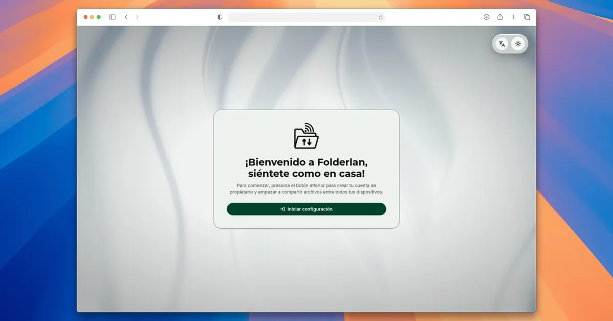

# 📁 Folderlan · [](https://github.com/ImMau14/Folderlan/actions/workflows/node-ci.yaml) [](https://github.com/ImMau14/Folderlan/actions/workflows/rust-ci.yaml)

**Forget about limitations. Share files instantly, directly between devices.**

Folderlan is a self‑hosted file‑sharing platform. One server, any device with a browser. No internet required on your LAN, no third‑party cloud, no subscription — your files stay on your hardware.

**English** · [Español](README.es.md) · [Italiano](README.it.md) · [Português](README.pt.md)

---



---

## Table of Contents

- [What is Folderlan?](#what-is-folderlan)
- [Use Cases](#use-cases)
- [Key Features](#key-features)
- [Quick Start](#quick-start)
- [Accessing from Other Devices (LAN)](#accessing-from-other-devices-lan)
- [Deploying as a Private Cloud (VPS)](#deploying-as-a-private-cloud-vps)
- [Configuration](#configuration)
- [How It Works](#how-it-works)
- [Security & Privacy](#security--privacy)
- [Build from Source](#build-from-source)
- [Maintenance](#maintenance)
- [License](#license)

---

## What is Folderlan?

Folderlan is a **client‑server application packaged as a single binary**. The backend (Rust + Actix‑web) is a REST API that stores files on disk, keeps metadata in an embedded SQLite database, handles authentication, and watches its own `uploads/` folder to register files that appear without going through the web UI. The frontend (React) is compiled and **embedded inside the binary**, so one single executable *is* the whole application: server, API and web interface.

You run one program, open `http://<host>:8080` in any browser, and you have a fully functional file‑sharing server with users, permissions, quotas and an audit trail.

---

## Use Cases

### 🏠 LAN file transfer — no internet, no cables

The original use case: two devices on the same Wi‑Fi, zero internet.

- Send documents, photos, videos and large files between your laptop, phone and desktop.
- Works fully offline — data never leaves your network.
- Ideal for private homes, offices, or trips with unreliable internet.

### ☁️ Private cloud on a VPS — your own minimal "Google Drive"

Because of its client‑server architecture, the exact same binary turns into a **minimalist self‑hosted cloud** when deployed on a rented VPS.

- Access your files from anywhere in the world, on any device.
- Give family, friends or colleagues their own accounts with granular permissions.
- Enforce per‑user storage quotas so nobody fills the disk.
- Full audit log of who did what, when, and from which IP.
- No account required by a third party — the data is yours, on your server.

### 👥 Team & office file sharing

Small teams that just need a shared space without onboarding a full SaaS.

- **Owner** (one) has full control; **visitors** get exactly the permissions you give them.
- Roles and per‑file access: `viewer` (see/download) vs `collaborator` (also delete, share, toggle public).
- Public/private visibility per file.
- Reset passwords, suspend accounts, delete users at any time.

### 📥 Drop‑folder automation

Folderlan watches its `uploads/` directory in real time.

- Copy or `scp` files directly into the folder (or have another program write there) and they appear in the web UI automatically — registered, searchable and shareable, no manual step.
- Works the other way too: deleting the file on disk marks it as deleted in the interface.
- Useful for upload buckets, backup drops, or feeding a shared library from an automation script.

### 🔒 Private media library & backup hub

- Keep family photos, project backups and documents on a box you control.
- JWT authentication + Argon2 password hashing keep unwanted guests out.
- Audit trail gives you full visibility into who accessed what.

---

## Key Features

### File management

- **Streamed uploads** — large files are streamed directly to disk with live progress in the UI; per‑file pause, resume and cancellation.
- **Smart storage** — sanitized filenames, automatic `name (1).ext` de‑duplication, MIME detection.
- **Search & filters** — by name, size range, upload date, visibility and uploader.
- **Secure downloads** — streamed with real‑time permission verification on every request.
- **Public/private visibility** — per file, toggleable in one click.
- **Granular sharing** — grant `viewer` or `collaborator` access on a file to specific users.
- **Bulk actions** — select multiple files to download, delete or change visibility at once.

### Users, roles & quotas

- **One owner** — full administrator access, created during first‑run setup.
- **Unlimited visitors** — accounts created by the owner with configurable permissions:
  - `can_upload` — allow/deny uploads.
  - `can_delete_own_files` — allow deleting one's own uploads.
  - `has_upload_limits` + `upload_limit` — per‑user storage quota in bytes.
- **Per‑file access levels:** `viewer` (download) or `collaborator` (delete, share, toggle public).
- **Account management** — activate/suspend users, reset passwords, soft‑delete (revocable) accounts.

### Monitoring, audit & security

- **File System Watcher** — instantly detects files added to or removed from `uploads/`, with stability checks (waits for the file to stop growing), deduplication and lock‑based race protection.
- **Complete audit trail** — every security‑relevant action logged with timestamp, user, IP address, event type and success/failure; explorable in the UI with filters.
- **JWT authentication** — 1‑hour tokens, HS256 signing, Argon2 password hashing.
- **Local‑only bootstrap** — setup, owner registration and owner password reset only accept requests from the host machine.
- **Configurable CORS** — locked to your origin by default; permissive mode available.

### Interface & experience

- **Single binary** — server + API + web UI embedded; nothing else to install.
- **Zero‑config start** — SQLite database self‑initializes on first run.
- **4 languages** — English, Spanish, Italian, Portuguese.
- **Light & dark themes** with system‑preference detection.
- **Responsive** — full layout for desktop, bottom‑nav layout for mobile.
- **Low‑detail mode** — disable heavy effects on low‑power devices.

---

## Quick Start

1. **Get the latest release** for your platform from the [releases page](https://github.com/ImMau14/Folderlan/releases). Pre‑built binaries are available for **Windows (32‑bit and 64‑bit)** and **Linux (64‑bit)**, compiled automatically by GitHub Actions.
2. **Run the binary** on the machine that will host your files.
3. **Open a browser** on that machine and go to `http://localhost:8080` (the default port).
4. **Complete the first‑run setup:** the web UI opens on the setup screen — click *Start*, choose an **owner username and password** (the owner is the administrator of your Folderlan instance), and you are automatically logged in and ready to upload.
5. **Start sharing.**

> [!WARNING]
> The first‑run setup (database creation, owner registration) must be done **from the host machine itself** (`localhost`). These steps are intentionally refused from other devices.

The server creates a SQLite database (`db/app.db` by default) and an `uploads/` folder next to the binary. All files you upload land in `uploads/`.

> [!TIP]
> At startup the server prints the addresses where the web UI is available — `Local` (same machine) and `Network` (your LAN IP, e.g. `http://192.168.1.50:8080`). Use the Network address to open Folderlan from other devices.

---

## Accessing from Other Devices (LAN)

1. Find the server's IP on the network — the easiest way: copy it from the **Network** URL printed at startup.
2. From any device on the same Wi‑Fi, open `http://<server‑ip>:8080` in the browser.
3. Visitors log in with accounts created by the owner (Users section in the dashboard).
4. To create visitor accounts, log in as owner → **Users** → *Create user* and set the permissions (upload, delete own files, storage quota).

> [!WARNING]
> Folderlan is served over plain HTTP, not TLS. Use it only on networks you trust — on public or shared Wi‑Fi, passwords and transferred files can be intercepted. For anything sensitive, prefer the [VPS + HTTPS](#deploying-as-a-private-cloud-vps) deployment.

> [!TIP]
> On Windows, allow the port through the firewall (`netsh advfirewall firewall add rule name="Folderlan" dir=in action=allow protocol=TCP localport=8080`) so other devices can connect.

---

## Deploying as a Private Cloud (VPS)

Anything that can run the Linux binary and is reachable from the internet works — a rented VPS, an old PC at home with port forwarding, or a Raspberry Pi.

You need:
- A domain (or just the server's IP).
- A reverse proxy (e.g. Nginx or Caddy) to terminate HTTPS — *strongly recommended*.
- Optionally, systemd to keep the server running.

> [!CAUTION]
> Do not expose Folderlan to the internet without a reverse proxy + HTTPS. Passwords and file transfers would travel in plain text. The built‑in setup endpoints are protected by `LOCAL_ONLY` — keep that guard until your proxy is in place, and only then set `LOCAL_ONLY=false`.

### Step 1 — Configure environment variables

Set these before the first run. At minimum `SECRET_JWT`, `LOCAL_ONLY=false` and (optionally) `OFF_CORS=true`:

```bash
export PORT=8080
export ADDRESS=0.0.0.0
export SECRET_JWT="$(openssl rand -hex 32)"   # persist this value!
export LOCAL_ONLY=false                        # setup endpoints become reachable through the proxy
export OFF_CORS=true                           # behind a reverse proxy, relax CORS to the proxy's origin
```

> [!IMPORTANT]
> `SECRET_JWT` signs your auth tokens. If it is not set, a **random key is generated on every start**, which invalidates all existing sessions after a restart. Generate it once and keep it.

### Step 2 — Run as a systemd service (Linux)

<details>
<summary><strong>Full systemd unit file</strong></summary>

Create `/etc/systemd/system/folderlan.service`:

```ini
[Unit]
Description=Folderlan file-sharing server
After=network.target

[Service]
Type=simple
User=folderlan
WorkingDirectory=/opt/folderlan
Environment=SECRET_JWT=REPLACE_WITH_YOUR_SECRET
Environment=LOCAL_ONLY=false
Environment=OFF_CORS=true
ExecStart=/opt/folderlan/folderlan
Restart=on-failure

[Install]
WantedBy=multi-user.target
```

```bash
sudo systemctl daemon-reload
sudo systemctl enable --now folderlan
```

</details>

### Step 3 — Reverse proxy with HTTPS

<details>
<summary><strong>Nginx configuration example</strong></summary>

```nginx
server {
    listen 443 ssl;
    server_name files.example.com;

    ssl_certificate     /etc/letsencrypt/live/files.example.com/fullchain.pem;
    ssl_certificate_key /etc/letsencrypt/live/files.example.com/privkey.pem;

    client_max_body_size 0;   # allow large uploads; the server streams them

    location / {
        proxy_pass http://127.0.0.1:8080;
        proxy_set_header Host $host;
        proxy_set_header X-Forwarded-For $proxy_add_x_forwarded_for;
        proxy_set_header X-Forwarded-Proto $scheme;
        proxy_read_timeout 300s;
        proxy_send_timeout 300s;
    }
}

server {
    listen 80;
    server_name files.example.com;
    return 301 https://$host$request_uri;
}
```

</details>

### Step 4 — First run on the server

1. Start the service and open `https://files.example.com` **from the server** (or use the proxy) to complete the setup and register the owner.
2. `LOCAL_ONLY=false` lets the setup endpoint be reached through your domain once the proxy is up.
3. Create visitor accounts, set quotas, and share away.

> [!NOTE]
> Back up the `db/` folder (SQLite database) and `uploads/` (your files) for disaster recovery — together they are your entire instance.

---

## Configuration

<details>
<summary><strong>Environment variables — server</strong></summary>

| Variable      | Type   | Default     | Description |
|---------------|--------|-------------|-------------|
| `PORT`        | u16    | `8080`      | TCP port to bind. |
| `ADDRESS`     | string | `0.0.0.0`   | Bind address. Use `127.0.0.1` for local‑only exposure. |
| `SQLITE_FILE` | string | `db/app.db` | Path to the SQLite database. Parent directories are created automatically. |
| `SECRET_JWT`  | string | *random hex* | JWT signing key (HS256). If unset, a new random key is generated **every start**, invalidating all tokens. Set it for persistence. |
| `OFF_CORS`    | bool   | `false`     | `true` → allow all origins; `false` → restrict to `http://{ADDRESS}:{PORT}` with `GET, POST, DELETE, PATCH, OPTIONS` and headers `Content-Type, Authorization`. |
| `LOCAL_ONLY`  | bool   | `true`      | When `true`, setup/owner‑recovery endpoints accept requests only from `127.0.0.1` / `::1`. Set to `false` when behind a reverse proxy. |

</details>

<details>
<summary><strong>Environment variables — file watcher</strong></summary>

These tune the monitor that watches `uploads/` in real time.

| Variable                      | Type  | Default | Description |
|-------------------------------|-------|---------|-------------|
| `WATCHER_IGNORE_TTL_SECS`     | u64   | `30`    | Seconds a recently processed file is ignored (deduplication). |
| `WATCHER_STABILITY_CHECK_MS`  | u64   | `300`   | Interval between size checks while waiting for a file to stop growing. |
| `WATCHER_STABILITY_REQUIRED`  | usize | `3`     | Consecutive stable‑size checks before a file is considered fully written. |
| `WATCHER_LOCK_TTL_SECS`       | u64   | `300`   | Lifetime of idle per‑file locks. |
| `WATCHER_PRUNE_INTERVAL_SECS` | u64   | `10`    | Interval for cleaning up internal structures. |
| `WATCHER_CHANNEL_CAPACITY`    | usize | `64`    | Internal event channel buffer size. |

For slow/remote filesystems (NFS, SMB), increase the stability values to avoid registering partially written files.

</details>

---

## How It Works

<details>
<summary><strong>Architecture overview</strong></summary>

```
┌────────────────────────────── Folderlan binary ─────────────────────────────┐
│                                                                            │
│   React SPA (embedded, served on the same origin)                          │
│        │  HTTP / JSON (REST API)                                           │
│   Actix‑web API ──▶ Auth (JWT + Argon2)                                    │
│        │              Users & roles & quotas                               │
│        │              Files & permissions                                  │
│        │              Audit log                                            │
│        ▼                                                                    │
│   SQLite (metadata)    uploads/ (files)    File System Watcher ──▶ auto‑reg │
└─────────────────────────────────────────────────────────────────────────────┘
```

- **One binary, one origin.** The web UI is compiled into the server binary and served from the same address as the API — no separate web server, no CORS in production.
- **Files on disk, metadata in SQLite.** The physical files live in `uploads/`, with sanitized filenames and automatic `name (1).ext` deduplication on collision; the database tracks names, sizes, ownership, visibility and permissions.
- **The watcher keeps them in sync.** Files dropped into `uploads/` by other means are auto‑registered (owned by the owner account); files deleted on disk are auto‑marked as deleted. A stability check ensures partially written files are never registered.
- **Permissions are evaluated per request.** Owner bypasses everything; public files are viewable; uploaders always see their own files; explicit grants (`viewer`/`collaborator`) unlock specific actions — anything else is `403`.

</details>

---

## Security & Privacy

<details>
<summary><strong>What is protected, and how</strong></summary>

- **Passwords:** hashed with **Argon2** (memory‑hard) — never stored in plain text.
- **Sessions:** short‑lived **JWT** tokens (1 hour) signed with your `SECRET_JWT`.
- **Bootstrap surface:** database init, owner registration and owner password reset are **local‑only** by default.
- **Deletion model:** users and files are **soft‑deleted** — reversible by the owner until physically removed.
- **Audit trail:** who, what, when, from which IP, and whether it succeeded.
- **Your data:** all files stay on your machine. No telemetry, no third‑party storage.

</details>

---

## Build from Source

<details>
<summary><strong>Requirements</strong></summary>

The following tools are required for the build scripts to work properly. The versions shown are the recommended and tested ones; similar versions should work.

- **Rust 1.96.0** or higher
- **NodeJS 24.16.0** or higher
- **PNPM 11.6.0** or higher

</details>

<details>
<summary><strong>Compilation steps</strong></summary>

1. **Clone the repository:**
   ```bash
   git clone --depth 1 https://github.com/ImMau14/Folderlan.git
   ```

2. **Build the project** — the script installs frontend dependencies, builds the React app, copies it into `backend/dist/` and compiles the Rust backend (which embeds the frontend):
   ```bash
   # On Linux or Git‑Bash
   bash scripts/build.sh

   # On Windows (Command Prompt)
   scripts/build.cmd

   # On Windows (PowerShell)
   ./scripts/build.ps1
   ```

   Add the `--release` flag for an optimized Rust binary:
   ```bash
   bash scripts/build.sh --release
   ```

3. **Run:**
   ```bash
   cd backend
   cargo run --release
   # or, if you built without --release:
   cargo run
   ```

4. Open `http://localhost:8080` and complete the first‑run setup.

</details>

---

## Maintenance

Folderlan is a **personal side project** built to solve a personal need and
maintained on free time. It is stable, but issues and pull requests may take a
while to get a response. Bug reports and security issues are handled through the
[issue templates](.github/ISSUE_TEMPLATE/), and the [security policy](SECURITY.md)
applies — expectations should stay aligned with a single‑maintainer hobby project.

---

## License

This project is licensed under the MIT License — see the [LICENSE](LICENSE) file for details.
